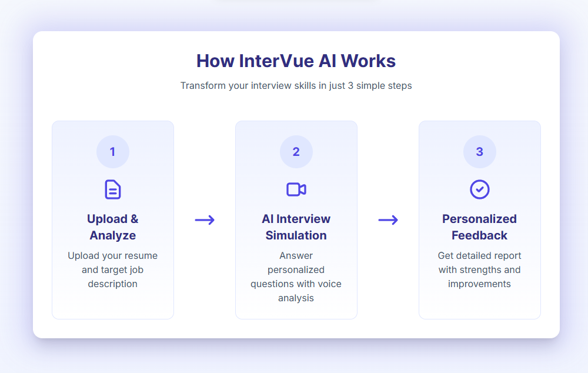
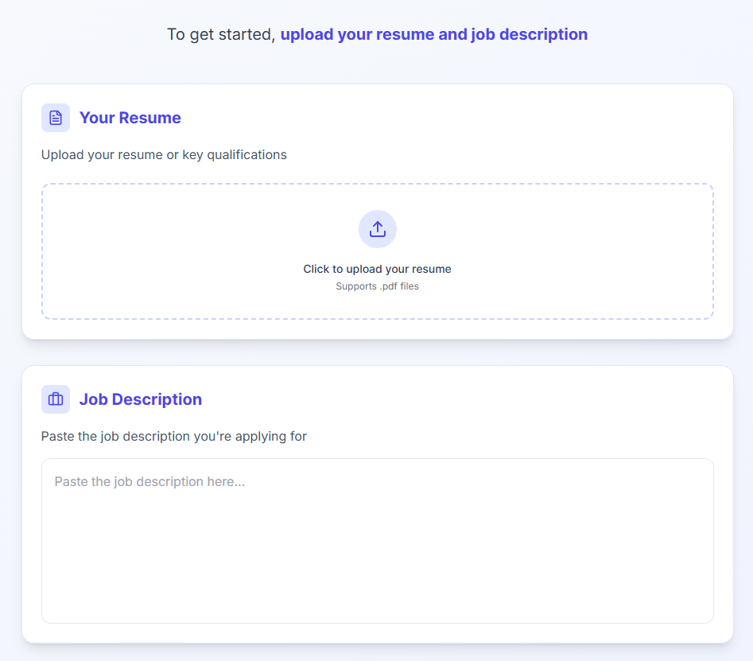
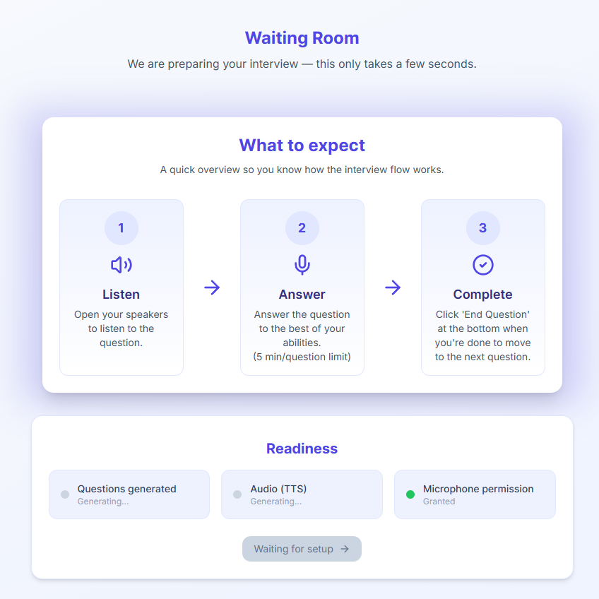
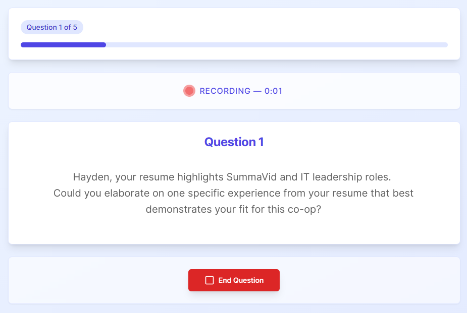
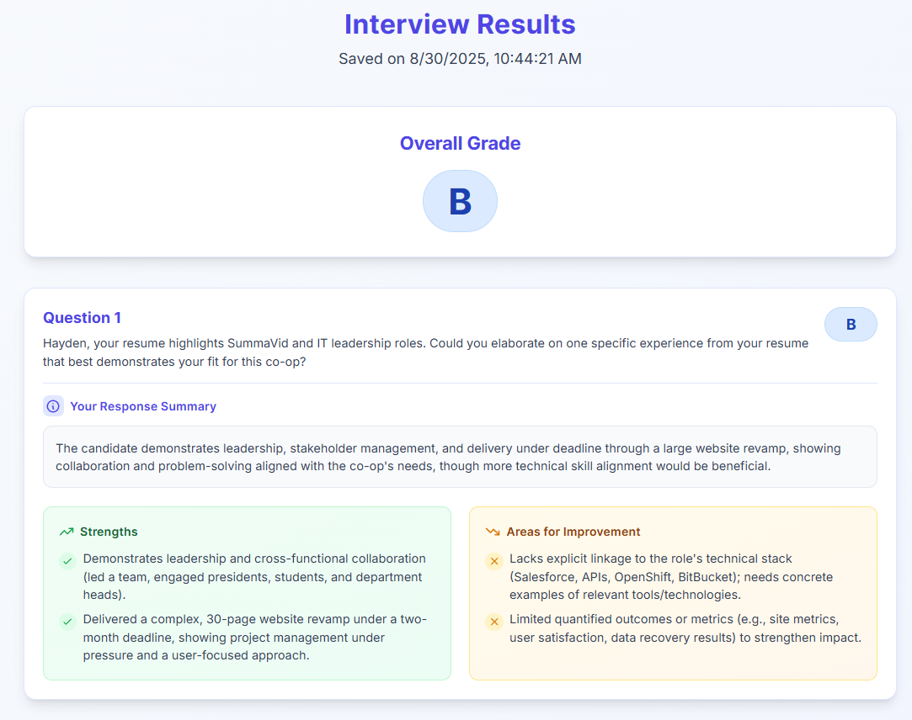

## InterVue AI
*InterVue AI is a tool to help job seekers to prepare for their interviews.*

<a href="https://www.intervueai.ca/" target="_blank">Click to check out InterVue AI!</a>

### Flowchart of user journey

### 1. Input your resume and job description

### 2. Get ready for the interview

### 3. Listen to the interviewer ask the question and respond accordingly, and repeat for a 5 question interview.

### 4. Read the analysis report on your interview performance
